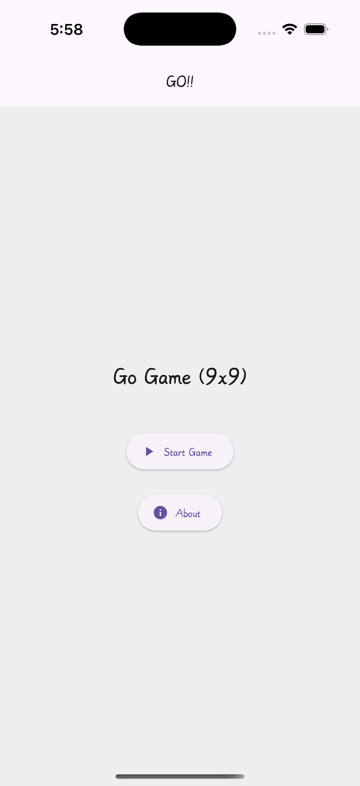
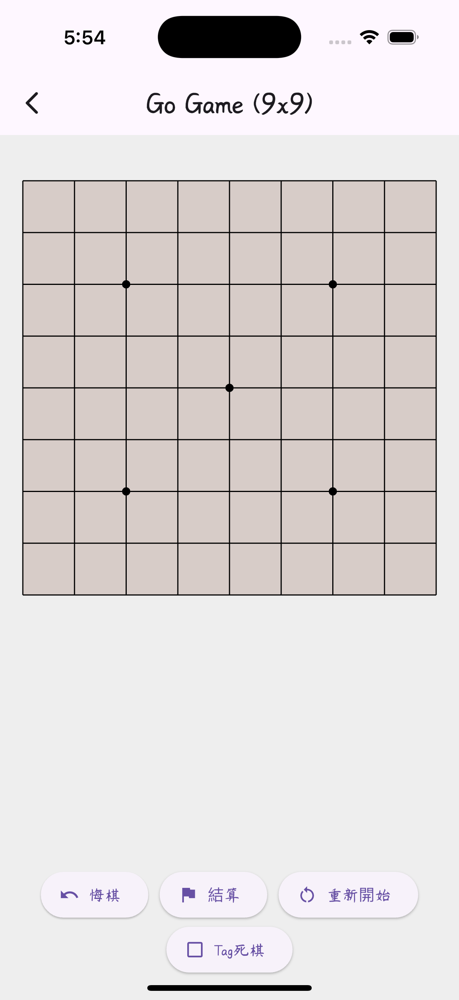
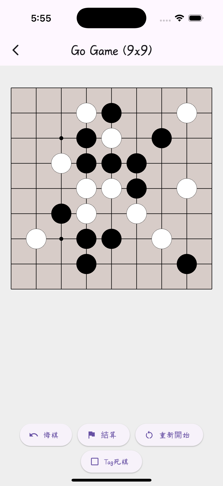

# Go Game (9x9)

A simple 9x9 Go game app built with Flutter. This project demonstrates how to integrate custom UI, gesture detection, and complex game logic—including stone placement, capture rules, suicide prevention, and scoring—into a polished mobile application.

## Features

- **Custom Board Rendering**  
  Uses `CustomPaint` to draw a detailed 9x9 Go board with star points.

- **Interactive Gameplay**  
  Leverages `GestureDetector` for precise touch controls. Supports stone placement, capture logic, suicide move prevention, and ko rule detection.

- **Game Mechanics**  
  Implements classic Go rules including:
  - Stone placement and capture
  - Undo move functionality
  - Marking dead stones for scoring
  - Resetting the game

- **Scoring System**  
  Calculates territories using a flood fill algorithm and applies Japanese scoring rules with komi.

- **Audio Integration**  
  Includes background music and move sound effects using the `audioplayers` package.

## Screenshots

<p align="center">
  
  
  
</p>

## Getting Started

### Prerequisites

- [Flutter SDK](https://flutter.dev/docs/get-started/install)
- A code editor like [Visual Studio Code](https://code.visualstudio.com/) or [Android Studio](https://developer.android.com/studio)

### Installation

1. **Clone the Repository**

   ```bash
   git clone https://github.com/yourusername/go-game-9x9.git
   cd go-game-9x9
   ```

2. **Install Dependencies**

   ```bash
   flutter pub get
   ```

3. **Configure Assets**

   Ensure that the following assets are added to your assets folder:
   - `background.mp3` (background music)
   - `sound.m4a` (move sound effect)

   Update your `pubspec.yaml` to include these assets:

   ```yaml
   flutter:
     assets:
       - assets/background.mp3
       - assets/sound.m4a
   ```

### Running the App

Run the following command to start the app on an emulator or connected device:

```bash
flutter run
```

## Project Structure

```
lib/
├── main.dart             # Entry point of the app
├── go_game_app.dart      # Main app widget and theme setup
├── main_menu.dart        # Main menu screen with background music
├── go_board.dart         # Game screen with board logic and custom drawing
└── board_painter.dart    # Custom painter for the Go board and stones

assets/
├── background.mp3        # Background music file
└── sound.m4a             # Move sound effect
```

## Contributing

Contributions are welcome! If you have ideas for improvements or bug fixes, please fork the repository and submit a pull request. For major changes, please open an issue first to discuss what you would like to change.

## License

Distributed under the MIT License. See [LICENSE](LICENSE) for more information.